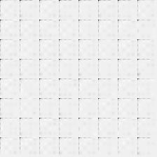
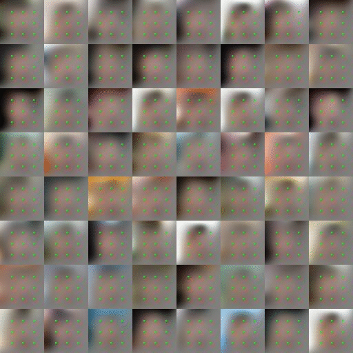
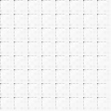
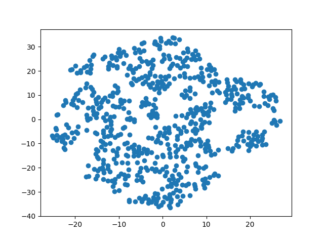
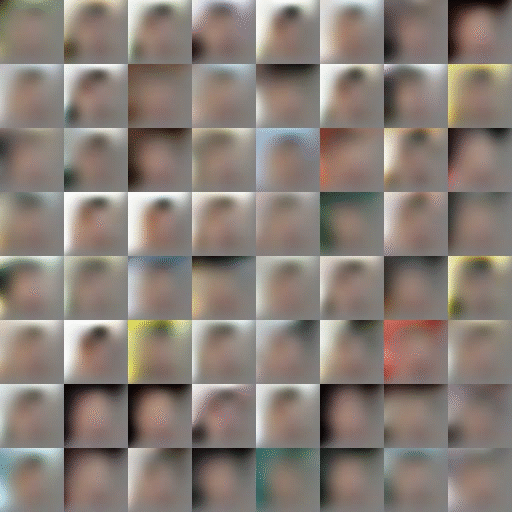
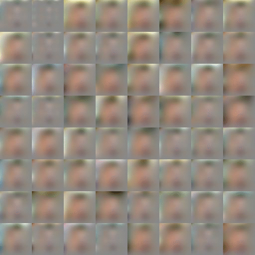
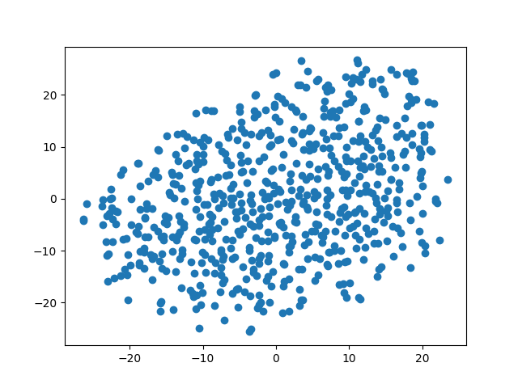

# DRAW




A Tensorflow implementation of [DRAW](https://arxiv.org/abs/1502.04623). Now includes support for colored images !

This is a slightly rewritten version of [kvfrans's implementation](https://github.com/kvfrans/draw-color).

This version now includes functions to generate new images similar to the dataset and visualize the latent vectors of the dataset with TSNE.


# Drawing MNIST





## Training

* ```python3 mnist_train.py -n test_mnist```

The checkpoints and results will be saved in ```logs/test_mnist```.
The parameters of the training are saved in ```logs/test_mnist/args.json```.

You can use the following options for the training :
* ``` -a ``` : Whether to read and write images with attention or not (see [DRAW](https://arxiv.org/abs/1502.04623) for more information). Default : True.
* ``` -nd ``` : Number of dimensions of the latent vector. Default : 10.
* ``` -sl ``` : Sequence length. Number of iterations to write images. Default : 10.
* ``` -ns ``` : Number of steps for the training. Default : 15000.
* ``` -nh ``` : Number of hidden layer in the recurrent neural network. Default : 256.

## Generate new images

* ```python3 mnist_generate.py -f logs/test_mnist```

The generated images will be saved in ```logs/test_mnist/generation```.
This script samples some latent vectors and writes the corresponding images.

You can change the following options for the generation :
* ``` -m ``` : Maximum mean. The mean of each dimension of the latent vectors is sampled uniformly between [-m,+m]. Default : 0.
* ``` -s ``` : Standard deviation for normal sampling the latent vectors. Default : 1.

## Visualize the latent vectors

* ```python3 mnist_dataviz.py -f logs/test_mnist```

The graph will be saved in ```logs/test_mnist/dataviz```.
You can change the following options :
* ``` -n ``` : Number of batches from the dataset to use. Default : 10.
* ``` -p ``` : Perplexity for TSNE. Default : 30.

# Drawing other datasets





You must put your new dataset in a "dataset" folder which should be in the same place than your "draw-color" folder : ```../dataset/my_dataset/```.
Be careful, your images will be cropped and resized to 64x64 pixels. You can either change the img_size parameter or pre-resize the images yourself if you are not satisfied.

The algo worked well with the CelebA dataset that you can find [here](http://mmlab.ie.cuhk.edu.hk/projects/CelebA.html).

## Training

* ```python3 color_train.py -d CelebA -n test_CelebA```

The checkpoints and results will be saved in ```logs/test_CelebA```.
The parameters of the training are saved in ```logs/test_CelebA/args.json```.

The previous training options are still available, as well as :
* ``` -d ``` : The name of your dataset folder. Default : CelebA.
* ``` -v ``` : Visualize the attention box in the results. Default : False.
* ``` -ne ``` : Number of epochs for the training. Default : 25.
* ``` -is ``` : Size of your images. Default : 178.


## Generate new images

* ```python3 color_generate.py -f logs/test_CelebA```

The generated images will be saved in ```logs/test_CelebA/generation```.
This script samples some latent vectors and writes the corresponding images.
The previous generation options are still available.


## Visualize the latent vectors

* ```python3 color_dataviz.py -f logs/test_CelebA```

The graph will be saved in ```logs/test_CelebA/dataviz```.
The previous options are still available.
